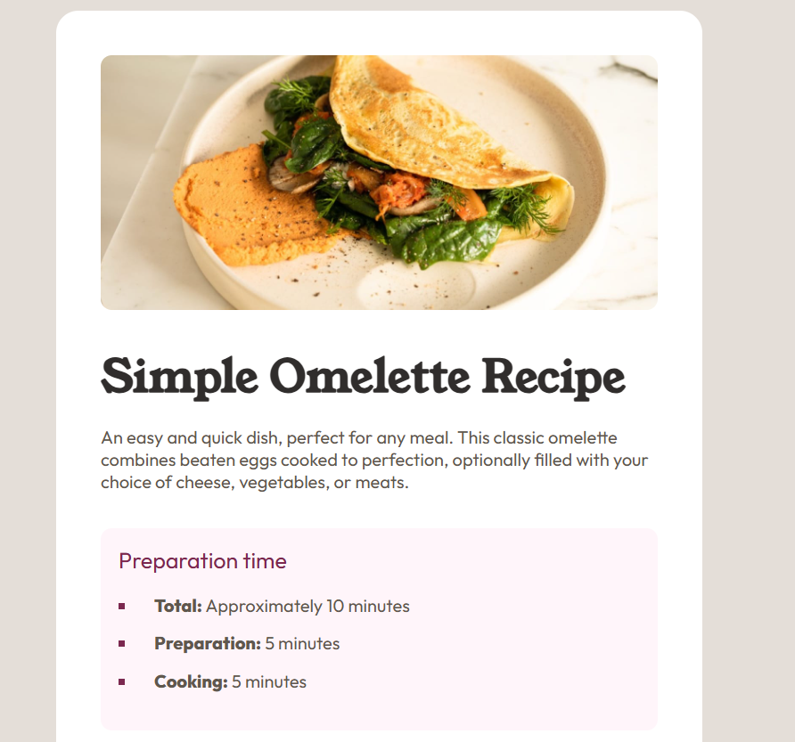
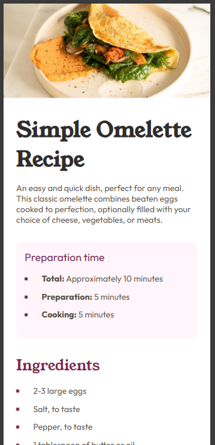

# Frontend Mentor - Recipe page solution

This is a solution to the [Recipe page challenge on Frontend Mentor](https://www.frontendmentor.io/challenges/recipe-page-KiTsR8QQKm). Simple recipe blog page.

## Table of contents

- [Overview](#overview)
  - [The challenge](#the-challenge)
  - [Screenshot](#screenshot)
  - [Links](#links)
- [My process](#my-process)
  - [Built with](#built-with)
  - [What I learned](#what-i-learned)
  - [Useful resources](#useful-resources)
- [Author](#author)

## Overview

### Screenshot

### Links

- Solution URL: [GitHub](https://github.com/carasi-official/FEM-Recipe-Page)
- Live Site URL: [Live Site](https://carasi-official.github.io/FEM-Recipe-Page/)

## My process

### Built with

- Semantic HTML5 markup
- CSS
- Vanilla JS
- Flexbox
- Responsive design

### What I learned

Used media queries to handle the custom css for the mobile view. Everything else was pretty standard though.
If there is a way to solve the mobile view without media queries for the custom styling I'd be curious to learn it!

#### Useful resources

- [MDN](https://www.example.comhttps://developer.mozilla.org/en-US/) – MDN never fails to save the day

## Author

- Website - [Github]( https://github.com/carasi-official?tab=repositories)
- Frontend Mentor - [@Carasi](https://www.frontendmentor.io/profile/carasi) 